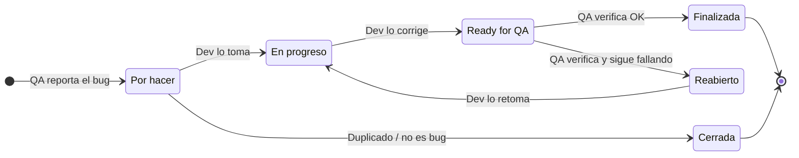

# Flujo de gestión de bugs

## Estados

| Estado | Significado | Responsable |
|---|---|---|
| **Por hacer** | Bug reportado, pendiente de asignar | QA reporta |
| **En progreso** | El desarrollador lo está corrigiendo | Dev |
| **Ready for QA** | Corregido, pendiente de verificación | QA |
| **Reabierto** | QA lo verificó y sigue fallando; vuelve a desarrollo | Dev |
| **Finalizada** | QA lo verificó y funciona correctamente | QA cierra |
| **Cerrada** | Cerrado sin corrección: duplicado o no es un bug | QA / PO |

## Reglas
- Un bug solo pasa a **Finalizada** cuando el QA lo verifica, no cuando el desarrollador dice que está arreglado.
- Al pasar a **Cerrada**, se deja un comentario con el motivo (por ejemplo: "Duplicado de #3").
- Cada bug lleva etiquetas de **Severidad**, **Prioridad**, **Componente** y **Módulo**.

## Convención de títulos
`Bug Fixing - [Flujo] - [Módulo] - [Pantalla] - Descripción del problema`

Ejemplo: `Bug Fixing - Login - Inventory - Products - Todas las imágenes de productos muestran la misma foto de un perro`
